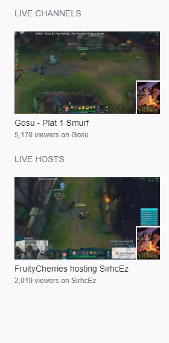
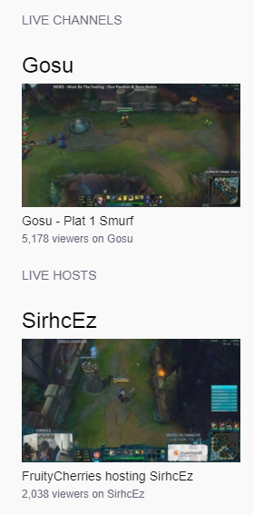

CURRENTLY BROKEN

# twitch-tv-following--custom-layout

This script customizes the layout of the user's [twitch.tv/directory/following](https://www.twitch.tv/directory/following) page.

It is also published at [greasyfork.org/en/scripts/32006-twitch-tv-following-custom-layout](https://greasyfork.org/en/scripts/32006-twitch-tv-following-custom-layout).

## Notes

Chrome requires the manifest.json to run this script as a native extension.

## Description

Current Features:

- Larger version of live stream's name above image preview.
- Remove mini-image preview.
- Clicking image preview directly opens hosted stream under Live Hosts.
- Removes all VODCAST streams under Live Channels. 
  |- Inspired by Max Brown's script at 
  |- https://greasyfork.org/en/scripts/30444-twitch-vodcast-remover

Feel free to modify the code to your liking. 
Please mention your updates, issues, and complaints on my github. 
https://github.com/ericchase/userscripts/issues

Comparison

| Before                    | After                   |
| ------------------------- | ----------------------- |
|  |  |
