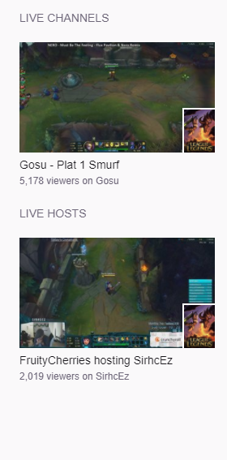

# twitch.tv-following--custom-layout
A [Tampermonkey](https://chrome.google.com/webstore/detail/tampermonkey/dhdgffkkebhmkfjojejmpbldmpobfkfo?hl=en) script to customize the layout of the user's [twitch.tv/directory/following](https://www.twitch.tv/directory/following) page.

Can also be installed from [greasyfork.org/en/scripts/32006-twitch-tv-following-custom-layout](https://greasyfork.org/en/scripts/32006-twitch-tv-following-custom-layout).

Notes
-----
This script is also compatible with Chrome directly as an extension. 
Chrome simply requires the manifest.json file as filled out.

Description
-----------
Current Features:
* Larger version of live stream's name above image preview.
* Remove mini-image preview.
* Clicking image preview directly opens hosted stream under Live Hosts.
* Removes all VODCAST streams under Live Channels. 
  |- Inspired by Max Brown's script at 
  |- https://greasyfork.org/en/scripts/30444-twitch-vodcast-remover

Feel free to modify the code to your liking. 
Please mention your updates, issues, and complaints on my github. 
https://github.com/ericchase/twitch.tv-following--custom-layout/issues

Comparison

|Before                   |After                  |
|------                   |-----                  |
|||
